#Gestión de órganos colegiados (GOC)

##Cómo acceder
El acceso principal a la aplicación se encuentra en http://ujiapps.uji.es/goc.

##Funcionalidades generales y componentes
La aplicación está estructurada en dos partes bien diferenciadas, el menú de acciones, que aparece en la izquierda, y la zona de trabajo en la derecha.
La aplicación es multiidioma, por lo que en función de los idiomas que la aplicación tenga habilitados, podremos cambiar de idioma haciendo clic en el nombre correspondiente, en la parte superior derecha.
Respecto al menú, cargará las distintas opciones disponibles, en función de los roles que el usuario tenga.
Cada vez que el usuario hace clic en uno de los menús, se abre una pestaña nueva en la zona de trabajo, de forma que el usuario puede tener más de una pestaña abierta, y cambiar entre ellas. De la misma forma, también puede cerrar las pestañas haciendo clic en la X situada en su esquina superior derecha.
Dentro de las distintas pestañas, el principal componente que encontramos es el *grid* o tabla de datos. 

###El componente *grid*
Este componente siempre sigue la misma estructura: en la parte superior tiene el título, a continuación una barra de botones de acción sobre las filas del grid, después los datos, y por último, en la parte inferior, una barra de paginación o de recarga de los datos.
Si hacemos clic sobre cada una de las columnas del *grid*, podemos ordenar los datos de forma ascendente o descendente (*siempre que la ordenación esté activada*). 

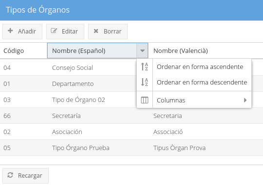

También veremos que aparece en la parte derecha de la cabecera de la columna, una flecha sobre la que podemos clicar y también ordenar por la columna, o ver el apartado de columnas disponibles del propio *grid*. En el caso que un *grid* tenga muchas columnas, y que estas no quepan en la pantalla, desde aquí es posible mostrar u ocultar las mismas, para facilitar la visualización.
Por último, también es posible cambiar el tamaño de las columnas arrastrando el margen de éstas en la cabecera. 

##Funcionalidades propias de la aplicación
* Gestión de los tipos de órganos
* Gestión de los órganos
* Gestión de los miembros
* Gestión de las reuniones
* Histórico de reuniones
* Gestión de los cargos

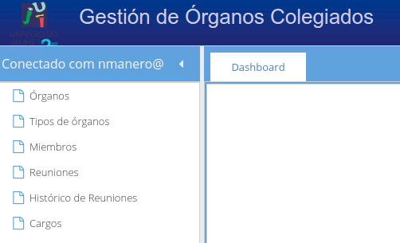

##Gestión de los tipos de órganos
Desde esta pantalla, el administrador puede gestionar los tipos de órganos que podremos utilizar.

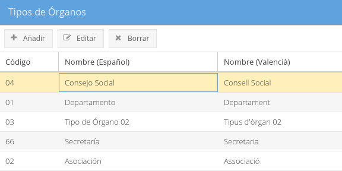

Para cada tipo de órgano podemos gestionar su código interno y el nombre, tanto en castellano como en valenciano. El código puede contener carácteres alfanuméricos.
Estos tipos nos ayudan a poder organizar mejor los órganos que posteriormente daremos de alta.
Para añadir un nuevo tipo tan solo tenemos que hacer clic sobre el botón "Añadir" de la barra de acciones. De la misma forma, para editar un tipo o eliminarlo, tendremos que hacer clic en el botón correspondiente, habiendo antes seleccionado la fila del tipo sobre el qué queremos realizar la operación.
No se permite borrar tipos que estén siendo usados por órganos.

##Gestión de los órganos
Desde esta pantalla se pueden gestionar todos los órganos de una entidad y sus autorizados.

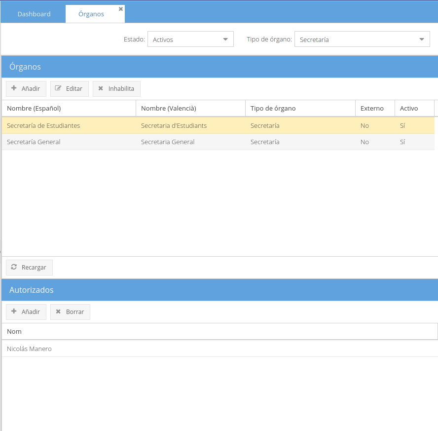

Los órganos los separamos en dos grupos: externos e internos. Los podemos diferenciar por la columna del *grid* correspondiente. También porque al seleccionar un órgano externo, los botones de *Editar* e *Inhabilitar* estarán deshabilitados. 

* Órganos Internos: son los órganos que se crean directamente desde esta aplicación. Desde aquí se pueden editar y habilitar o inhabilitar.
* Órganos Externos: son los órganos que se cargan de una aplicación externa a través del API. Estos órganos solamente aparecen aquí en modo consulta, no se pueden modificar ni inhabilitar. La gestión de estos se delega en la aplicación sobre la que se integra.

Si inhabilitamos un órgano, este ya no aparecerá en los listados para invitarlo a reuniones, pero seguirá apareciendo a nivel de consulta y estadística.

En esta pantalla, tal y como se ve en la imagen superior, aparecen dos *grids*. En el superior aparecen los órganos, y al seleccionar uno de ellos, en la tabla inferior aparecerán sus **autorizados** (*Los autorizados son las personas que pueden gestionar un órgano. Por tanto, estas personas solamente verán la información relativa al órgano u órganos que gestionan. Este permiso lo otorga el administrador.*)

Podemos filtrar la información de esta tabla por estado y por tipo de órgano. Los estados pueden ser activo o inactivo y los tipos se corresponden con los que hemos definido en el apartado anterior.

Para añadir nuevos órganos, tendremos que hacer clic sobre el botón *Añadir*. Y si queremos añadir miembros a un órgano, tendremos que seleccionar primero éste, y después hacer clic en el botón *Añadir* del *grid* inferior.

##Gestión de los cargos
En esta pestaña podemos gestionar los cargos que tendrán los miembros que forman parte de los órganos.

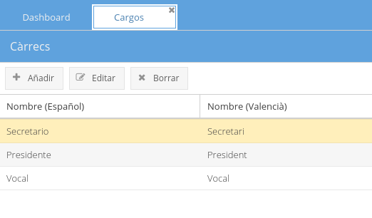

Los cargos son globales a toda la aplicación, por lo que pueden ser utilizados en todos los órganos, independientemente de qué persona sea la autorizada a gestionarlos.

No está permitido borrar un Cargo cuando esté está asignado a algún miembro de algún órgano.

##Gestión de los miembros
En esta pantalla se pueden gestionar las personas que componen cada uno de los órganos, y sus cargos.
En la parte superior, tal y como se ve en la siguiente imagen, nos aparece un campo desplegable donde están todos los órganos. Al seleccionar uno de ellos, se muestra a continuación el *grid* con los miembros del órgano.

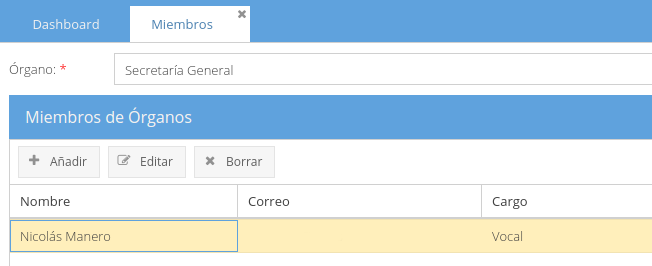

Si el órgano es externo, sus miembros no son editables, ya que se cargarán también a través del API. En cambio, si son internos, podemos añadir nuevos, editar los existentes y borrarlos.

##Gestión de las reuniones
En esta pantalla es donde se crean y editan las reuniones entre los órganos. Cada autorizado solamente podrá hacerlo sobre los órganos que tiene autorización, tal y como se ha mencionado en el apartado de Órganos.

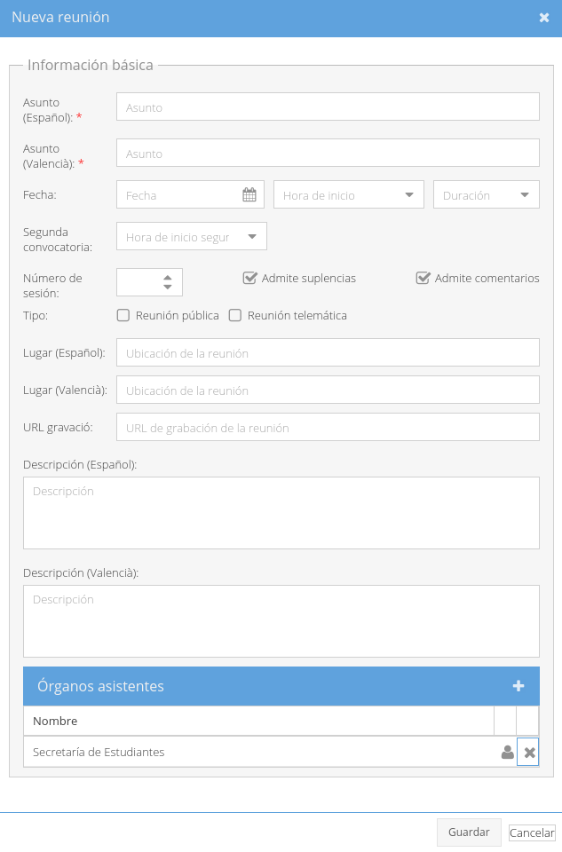

Como se muestra en la imagen superior, una reunión puede constar de los siguientes datos:

* Asunto: El título de la reunión.
* Fecha, hora y duración: Los datos de cuando se convoca.
* Segunda convocatoria: Si existe un horario de segunda convocatoria, se puede indicar en este campo.
* Número de sesión: En el caso que la reunión esté numerada, como las Juntas de Gobierno.
* Admite suplencias: Si se marca, el convocado podrá seleccionar un sustituto para ir en su ausencia. Si no lo marcamos, el convocado no podrá enviar a nadie en su ausencia.
* Admite comentarios: Si se marca, los convocados podrán añadir comentarios a la reunión o al orden del día, que el resto de convocados podrán ver.
* Tipo: Para indicar si será pública y/o telemática.
* Lugar: Dónde se celebrará la reunión.
* URL Grabación: URL donde se encuentra el fichero de la grabación
* Descripción: Descripción general de la reunión
* Órganos asistentes: Cada uno de los órganos convocados para esta reunión.

En cuanto a los órganos asistentes, en la imagen superior aparece ya como ejemplo uno seleccionado (*Secretaría de Estudiantes*) y en su misma fila, aparecen dos iconos, la X que desconvoca al órgano de la reunión, y el icono con forma de usuario, que permite gestionar los miembros asistentes y suplentes del órgano.

Al crear una reunión, tal y como se ve en la siguiente imagen, nos aparecerá en el *grid* superior la reunión, con los datos que hemos introducido.

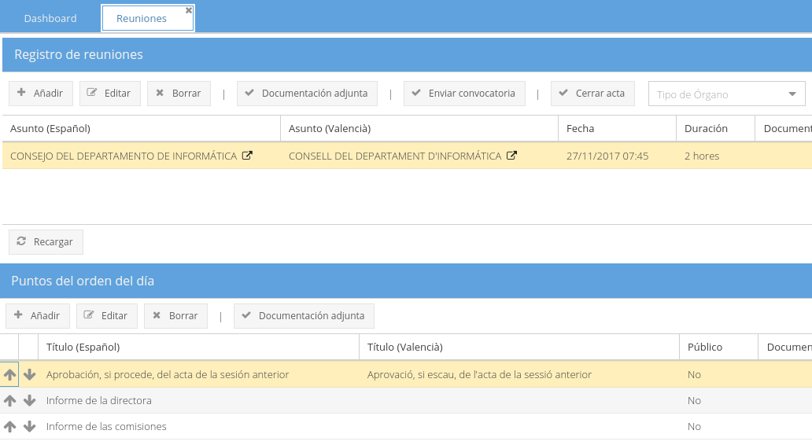

Al seleccionarla, en el *grid* inferior veremos los puntos del orden del día de la misma. Con los botones de acción del *grid* superior, podremos editar la reunión, añadir documentación adjunta, enviar la convocatoria a los miembros seleccionados, o cerrar el acta, una vez ya ha pasado la reunión.

Al seleccionar la reunión, en el *grid* inferior se muestran los puntos del orden del día. Con los botones de acción, podremos añadir, editar o borrar los puntos, y también añadir documentación concreta a uno de los puntos.

Para cada punto del orden del día, tal y como se muestra en la siguiente imagen, podemos gestionar el título, la descripción, las deliberaciones y los acuerdos. También si el punto será público o interno.

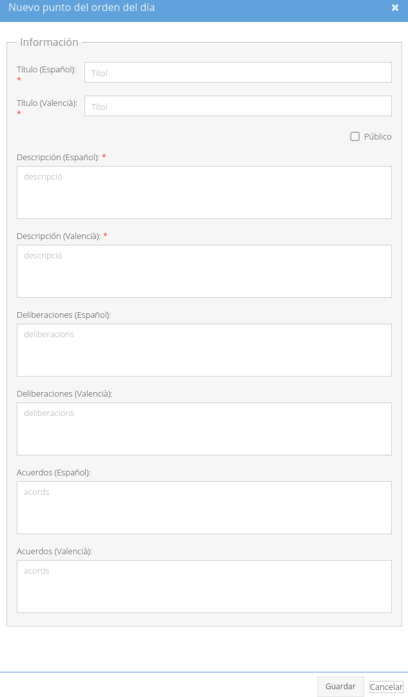

Una vez esté la reunión rellenada con los puntos del orden del día, se debe hacer clic en el botón *Enviar convocatoria*, de forma que todos los convocados reciban un correo electrónico con la información de la convocatoria, y puedan confirmar su presencia. En los correos electrónicos, se envía un enlace a una página web donde pueden ver la información de la reunión. Un ejemplo de esta página puede ser la siguiente imagen:

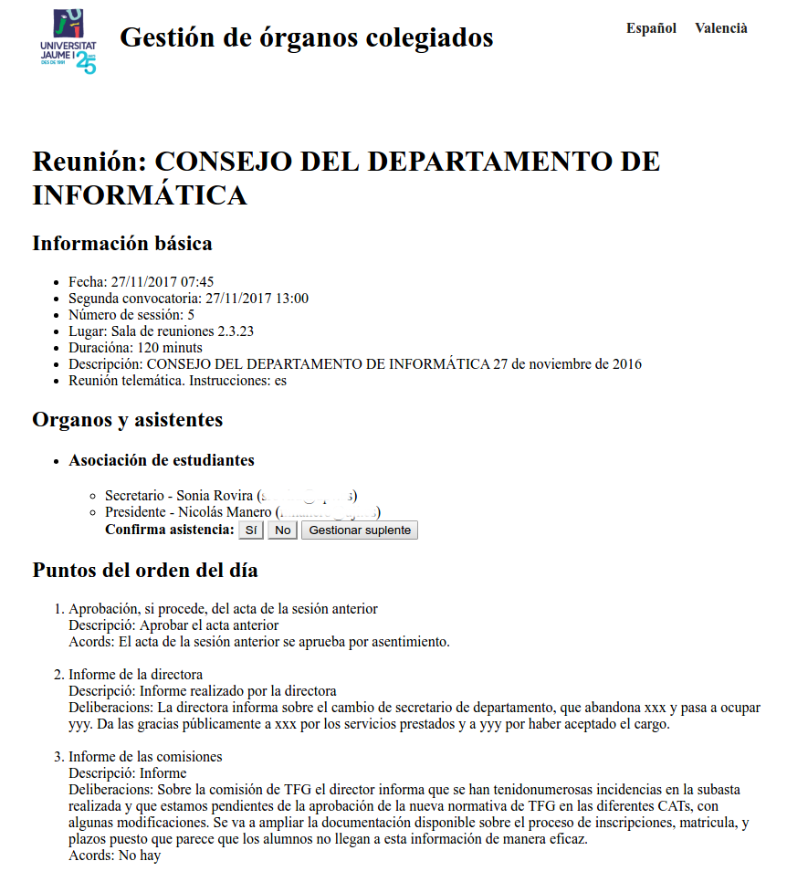

En ella podemos confirmar nuestra asistencia, o indicar la persona que nos sustituirá (siempre que la reunión admita sustitutos). También, aunque no aparece en la imagen, disponemos de un apartado de comentarios para comentar cualquier cosa sobre la reunión y que el resto de asistentes puedan verlos.

Esta página siempre está accesible, para cada reunión, haciendo clic en el icono con la flecha, que aparece en cada una de las reuniones del *grid*, tal y como se muestra en la siguiente imagen.

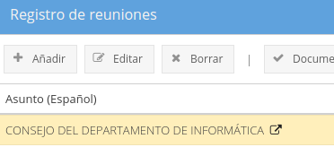

##Páginas de información
GOC incluye una serie de páginas web para consultar la información de las reuniones, de forma que no sea necesario acceder a la web de administración. De esta forma, las personas convocadas pueden acceder a esta información. Estas páginas también tienen en cuenta el usuario que accede, para mostrarle solamente la información de las reuniones sobre las que tiene acceso. También tienen en cuenta si la reunión o los puntos de ella son públicos o privados, de forma que en el pdf de una acta no se muestran los puntos privados. Una ejemplo de estas páginas es la que se ha mostrado en el apartado anterior.

Otra web, también disponible, nos muestra el listado de todas las reuniones a las que nuestro usuario tiene acceso.

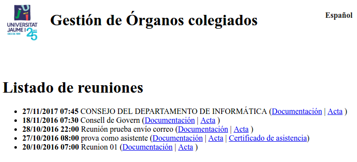

Desde esta web podemos acceder a:

* La página de información detallada de cada reunión, que es la misma de la que se ha hablado en el punto anterior.
* Descargar del acta generada de la reunión, en formato pdf.
* Descargar de un certificado de asistencia a la reunión, en formato pdf.

Tanto el diseño de estas páginas, como el de los pdfs generados, puede personalizarse para cada entidad, adaptándolo a su propia imagen.

##Histórico de reuniones
En esta pantalla podemos visualizar las reuniones ya pasadas para poder consultar su información y descargar los documentos que se utilizaron o generaron.

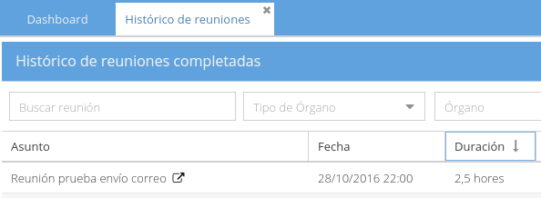